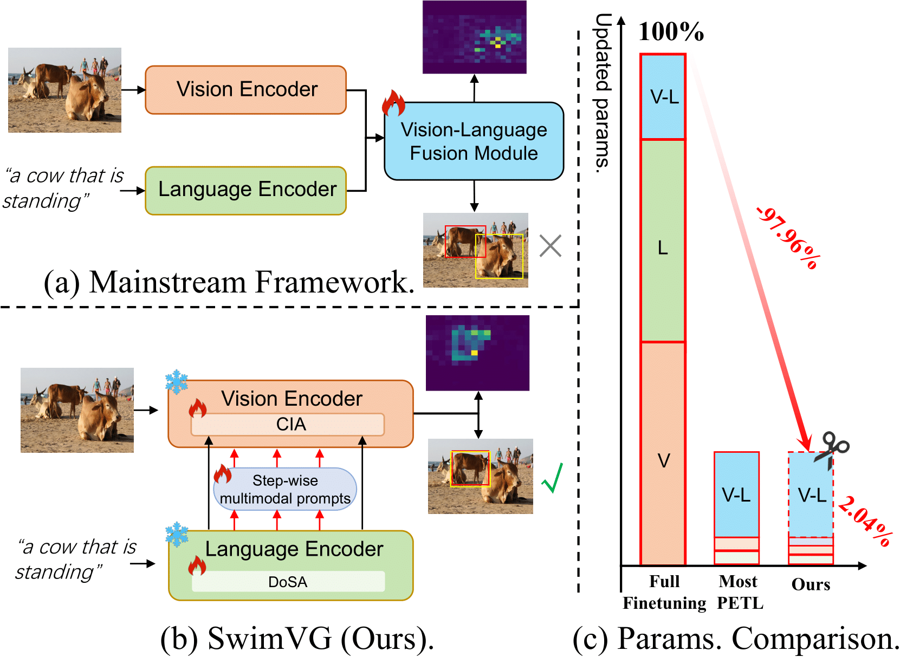

# SwimVG

This is an official PyTorch implementation of [SwimVG: Step-wise Multimodal Fusion and Adaption for Visual Grounding](https://arxiv.org/abs/).

<h5 align="center"> 


[Liangtao Shi]()<sup>1*</sup>,
[Ting Liu]()<sup>2* </sup>,
[Xiantao Hu]()<sup>3</sup>,
[Yue Hu]()<sup>2</sup>,\
[Quanjun Yin]()<sup>2</sup>,
[Richang Hong,]()<sup>1✉️</sup>

<sup>1</sup>Hefei University of Technology, <sup>2</sup>National University of Defense Technology, \
<sup>3</sup>Nanjing University of Science and Technology

# Overall Architecture


# Comparasion with Mainstream Framework
<div align=center>

</div>

# Preparation

## Environment
```bash
conda create -n SwimVG python=3.9.18 -y
conda activate SwimVG
pip install torch==2.0.1 torchvision==0.15.2 torchaudio==2.0.2
pip install -r requirement.txt
```

## Datasets
The detailed instruction is in [prepare_datasets.md](tools/prepare_datasets.md)

## Pretrained weights
Download the pretrained weights of DiNOv2-L and ViT-B to pretrain
```bash
mkdir pretrain && cd pretrain
## DiNOv2-L
wget https://dl.fbaipublicfiles.com/dinov2/dinov2_vitl14/dinov2_vitl14_reg4_pretrain.pth
## ViT-B
wget https://openaipublic.azureedge.net/clip/models/5806e77cd80f8b59890b7e101eabd078d9fb84e6937f9e85e4ecb61988df416f/ViT-B-16.pt
```


# Quick Start


```
bash run_scripts/train.sh
```

If you want to use multi-gpu training, simply modify the `gpu` in the run_scripts/train.sh. Please notice that you should execute this bash script under the first-level directory (the path with train.py).

To evaluate SwimVG, specify the model file path in test.sh according to your requirements and run the script:

```
bash run_scripts/test.sh
```

If you want to visualize the results, simply modify the `visualize` to `True` in the config file. 

## Results
| Method        | Backbone  |   Tuned/Total param. | RefCOCO (val) | RefCOCO (testA) | RefCOCO (testB) | RefCOCO+ (val) | RefCOCO+ (testA) | RefCOCO+ (testB) | RefCOCOg (val(g)) | RefCOCOg (val(u) | RefCOCOg (test(u) | Flickr30K (test)   |
|------------------------------|-----------------------|-------|---------------|------------------|-----------------|----------------|-------------------|------------------|----------------|------------------|----------------|-------|
|MaPPER [EMNLP24]     |   DINOv2/BERT-B      |  6.2%   | 86.03          | 88.90            | 81.19           | 74.92          | 81.12             | 65.68            | 74.60          | 76.32            | 75.81           | -  |
|HIVG [MM24]     |     CLIP-B   | 20.1% | 87.32          | 89.86            | 83.27          | 78.06          | 84.81             | 68.11            | -          | 78.29            | 78.79           | 82.11  |
| SwimVG    |   DINOv2/CLIP-B  |**2.03%**| **88.29**     | **90.37**        | **84.89**      | 77.92       | 83.22         | **69.95**        | **79.10**     | **80.14**       | **79.69**       | **83.10** |


## Weights

Our model weights have already been open-sourced and can be directly downloaded from [[Gdrive]](https://drive.google.com/drive/folders/1TA1pbADMjhmDhMf3TPVv97LEvUlzeq8W)

# Acknowledgements

The code is based on [MaPPER](https://github.com/liuting20/MaPPER), and [DiNOv2](https://github.com/facebookresearch/dinov2). We thank the authors for their open-sourced code and encourage users to cite their works when applicable.

# Citation

If SwimVG is useful for your research, please consider citing:


